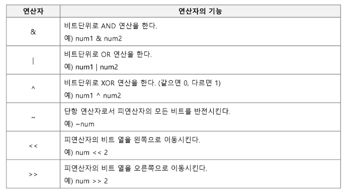
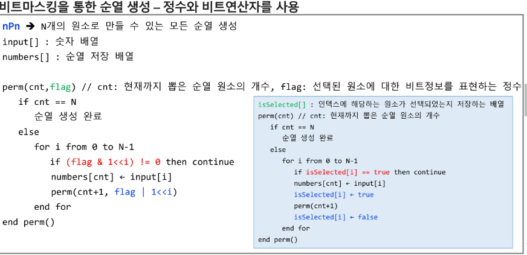
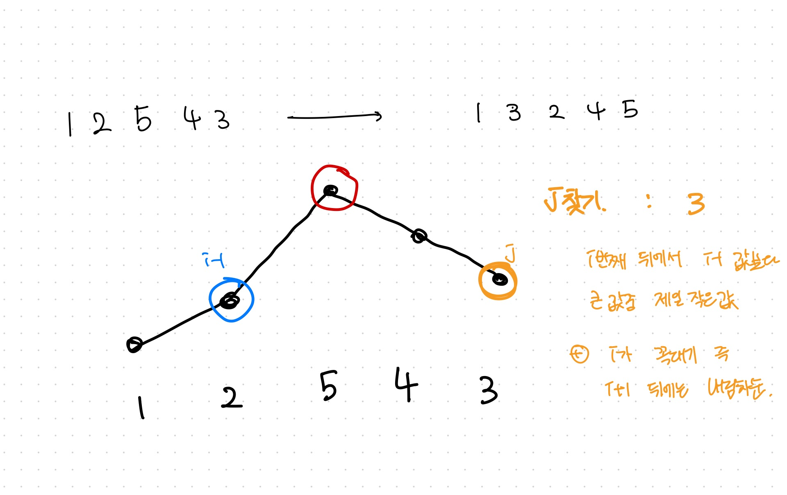
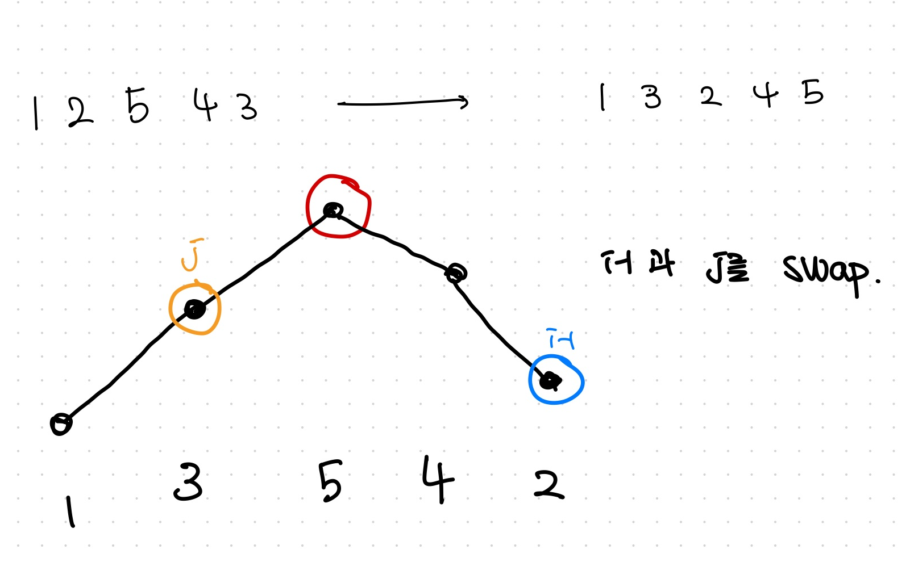
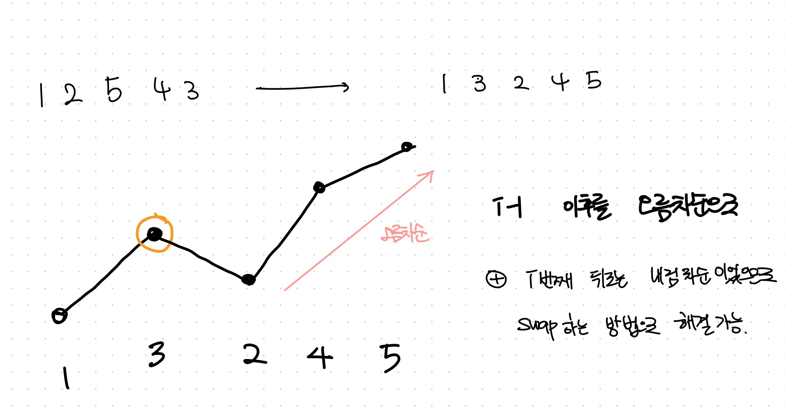

# 순조 응용

작성일시: 2024년 2월 8일 오전 9:07
주차: 4주차
복습: No

# 비트 연산



- 비트 한자리는 2개의 상태를 지닌다. 0/1
- ⭐⭐ 비트 연산자는 언어마다 우선순위가 복잡함… 그냥 속편하게 ()를 활용하는 것을 추천함.

```java
& : 상태 확인
| : 상태 주입
^ 1 : 상태 변경 (0 ^ 1 -> 1, 1 ^ 1 -> 0)
^ 0 : 상태 유지 (0 ^ 0 -> 0, 1 ^ 0 -> 1)
<< : *2
>> : / 2 

⇒ 꼭 *2, /2 가 되는 것은 아니다!!! 부호에 영향을 줄 수도 있다!!
```

Q. 만일 주어진 표현 범위를 넘어가지면? 

→ 예를 들어 long이라면 2^64여기서 *2 즉 <<을 한다면, 1111111…111110(2)가 되어버림. 

⇒ 꼭 *2, /2 가 되는 것은 아니다!!! 부호에 영향을 줄 수도 있다!!⭐⭐

# 순열 응용

## 비트 마스킹 순열

- 수의 선택 여부를 정수로 관리한다!
- 정수는 64bit까지 커버 가능!
- nPn ⇒ n! ⇒ 10! 까지만. 그 이상은 값이 너무 커진다.



- flag에 정수 값을 넣어주고. 이곳에 비트연산을 이용해 상태를 저장.
- flag & (1 << i) 를 사용. flag내부 값을 변경한 것이 아님.
- 깊이가 들어갈 때 flag | (1 << i) 를 통해서 값 존재만 체크한 것.
- visited[]를 사용했을 때 발생하는 false로 바꾸지 않는 실수를 줄일 수 있다.

→ 자바에서는 비트마스킹을 쓴다고 더 빨라지지 않는다… 기호 차이! 

⇒⭐⭐ 따라서 메모리가 부족한 게 아니라면 굳이 비트마스킹을 이용한 순조부를 만들 필요가 없다!

## Next Permutation

- 다음 순열 → 현재 순열 바로 다음에 사전순으로 오는 순열 (123 다음은 132)
- 재귀를 사용하지 않아 속도가 빠르다.

### 알고리즘 진행 방식

- 배열을 오름차순으로 정렬한 후 시작한다. → 가장 작은 순열을 찾는다.⭐
- nextPerm() 메서드를 만들어서 다음 순열 값으로 변경 및 다음 순열 변경 가능여부를 반환.

1. 뒤쪽부터 탐색하며 i를 찾는다. 큰 값. 꼭대기! ⇒ i-1 < i > i+1인 값.


1. 뒤쪽부터 탐색하며 교환위치와(i-1) 교환할 큰 값 위치(j) 찾기 ⇒ j는 i-1 위치 값보다 큰 값중에 최소값



1. 두 위치 값(i-1, j) 교환



4. 꼭대기 위치부터 맨 뒤까지 오름차순 정렬 (교환 직후에는 내림차순으로 되어 있음, swap을 이용해서 가능함)




```java
import java.util.Arrays;

public class NextPermMain {

	static int N = 4, C = 0;
	static int[] a = {3, 1, 4, 2};

	public static void main(String[] args) {
		Arrays.sort(a); // *** 먼저 정렬해 주어야함!!
		do {
			System.out.print(Arrays.toString(a)); // 순열 내용 출력
			C++;
			System.out.println(); 
		} while (nPn()); // next Permutation 수행!
		System.out.println(C); // 총 순열의 개수 출력
	}

	// 초기값이 N-1인 변수가 3개가 필요함!
	private static boolean nPn() {
		int i = N-1; // 1. 꼭대기 찾기!
		while(i > 0 && a[i-1] >= a[i]) i--; // 값이 작아지는 위치 = i; *** >= 인 것 유의!!!
		if(i == 0) return false; // 다음 순열 값이 없음!	

		int j = N-1; // 2. 교환할 값 찾기
		while(a[i-1] >= a[j]) j--; // j >= i-1이면서 a[i-1]보다 큰값중에 최소값. -> i부터는 오름차순으로 되어있음 a[i-1] 인것 찾으면 됨

		swap(i-1, j); // 3. 교환!

		int k = N-1;  // 
		while(i < k) swap(i++, k--); // 4. i이후를 오름차순으로 바꾸기 위해서!
		return true;
	}
	
	static void swap(int i, int j) {
			int temp = a[i];
			a[i] = a[j];
			a[j] = a[temp];
	}

}
```

# 조합 응용

## Next Permutation 활용

1. int[] p 를 만들어서 뒤에서부터 r개만큼 1로 초기화(나머지는 0) → 선택한 원소를 나타내기 위해
2. np알고리즘을 수행한다. → 0이 아닌 값의 위치가 변경됨

```java
import java.util.Arrays;

public class NextCombMain {
	
	static int N = 4, R = 2, C = 0;
	static int[] a = new int[N];
	
	public static void main(String[] args) {
	for(int i = 0; i < R; i++) a[N-1-i] = 1; // {0,0,1,1} 상태표현으로 만들고, 정렬되어 있어야함.
		do {
			System.out.println(Arrays.toString(a)); C++;
		} while(npn());
		System.out.println(C);
	}

	private static boolean npn() {
		int i = N-1;
		while(i > 0 && a[i-1] >= a[i]) i--;
		if(i == 0) return false;
		
		int j = N-1;
		while(a[i-1] >= a[j]) j--;
		
		swap(i-1, j);
		
		int k = N-1;
		while(i <= k) swap(i++, k--);
		return true;
	}

	private static void swap(int i, int j) {
		int temp = a[i];
		a[i] = a[j];
		a[j] = temp;
	}

}

/*
[0, 0, 1, 1]
[0, 1, 0, 1]
[0, 1, 1, 0]
[1, 0, 0, 1]
[1, 0, 1, 0]
[1, 1, 0, 0]
6
*/
```

- 순열은 어떻게 해도 시간복잡도는 **O(n!)**입니다.  nPr이기 때문이죠. 다만,  recursive function 사용시 호출되는 시간이 있기 때문에 next_permutation으로 사용한다면 어느정도 시간 단축은 가능합니다.

⇒ 다른 블로그 글에서 가져왔습니다. 시간 복잡도에 대해서는 의문이 있지만, 재귀호출시에 소모되는 시간과 nextPermutation의 빈번한 백트래킹으로 인해 상당한 시간이 단축된다는 것을 기억하면 좋을 거 같아요!

- 대부분의 문제들이 순열을 구하라는 것 보다는 조합을 구하는 문제가 많습니다. 따라서 nextPerm을 순열을 구하기 위해 필요하다! 보다는 조합에서도 많이 쓰인다고 알고 있으면 좋을 거 같아요!