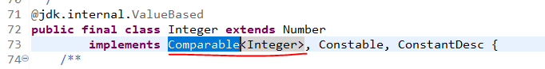

# 정렬

- 요소를 특정 기준에 대한 내림차순 또는 오름차순으로 배치하는 것
- 그럼 정렬 기준은 어떻게 설정하는 가??

```java
int[] arr = {1,4,2,3};
List<Integer> list = Arrays.asList(3,4,1,2);
List<String> strList = Arrays.asList("b", "a","c");

// sort!
Arrays.sort(arr);
Collections.sort(list);
Collections.sort(strList);

System.out.println(Arrays.toString(arr)); // [1, 2, 3, 4]
System.out.println(list); // [1, 2, 3, 4]
System.out.println(strList); // [a, b, c]
```

sort의 기준을 우리는 설정해주지 않았는 데 , 오름차순으로 정렬이 된다. 어떻게 가능한가?

⇒ Integer, String이 Comparable을 상속했기 때문에!




## Comparable

- 정렬과 관련한 메서드를 가지는 interface!

```java
public interface Comparable<T> {
    public int compareTo(T o);
}
```

- Comparable를 상속하고 있는 Integer에서는 이런식으로 구현되어 있다.

```java
public final class Integer extends Number
        implements Comparable<Integer>, Constable, ConstantDesc {

...

		public int compareTo(Integer anotherInteger) {
        return compare(this.value, anotherInteger.value);
    }

    public static int compare(int x, int y) {
        return (x < y) ? -1 : ((x == y) ? 0 : 1);
    } 
/* 
* x < y 라면 -1
* x == y 라면 0
* x > y 라면 1
* 오름차순으로 정렬이 된다.
*/

...
```

- 만일 우리가 객체를 만들었다면, 그 클래스는 정렬이 불가능! 따라서 Comparable interface를 통해 Comparable하다는 것과 기준을 설정해 주어야 한다.

```java
public class Student {
	
	private int stuid;

	public Student(int stuid) {
		this.stuid = stuid;
	}

}

public class Professor implements Comparable<Professor> {
	
	private int profId;

	public Professor(int profId) {
		this.profId= profId;
	}

	@Override
	public int compareTo(Professor o) {
		return Integer.compare(profId, o.profId);
	}

}

Student[] students = {new Student(1), new Student(3), new Student(2)};
Professor [] professors= {new Professor (1), new Professor (3), new Professor (2)};
// Arrays.sort(students); // java.lang.ClassCastException 런타임에러
Arrays.sort(professors); // 1, 2, 3 순으로...
```

## Comparator

- 클래스 내부에에 정렬 기준을 설정하지 않고 따로 정렬 기준을 만들어 두고, 정렬할 때 기준을 제공하는 방법

```java
public interface Comparator<T> {
	int compare(T o1, T o2);
}

public class StringLenghthComparator implements Comparator<String> {
	@Override
	public int compare(String o1, String o2) {
		int len1 = o1.length();
		int len2 = o2.length();
		return Integer.compare(len1, len2);
	}
}

public void stringLengthSort() {
	Collections.sort(names, new StringLengthComparator()); // 기준을 설정해서 정렬
	System.out.println(names);
}
```

- 딱 한번만 사용하는 정렬기준이 존재한다면, 굳이 Comparator를 만들 필요성에 대한 의문
    
    → anonymous inner class!
    

```java
Arrays.sort(names, new Comparator<String>() {
			@Override
			public int compare(String o1, String o2) {
				int len1 = o1.length();
				int len2 = o2.length();
				return Integer.compare(len1, len2);
			}
		});

// lambda 적용
Arrays.sort(names, (o1, o2) -> Integer.compare(o1.length, o2.length));
```

---------


### 코드 예시 

```java
class TitleComparator implements Comparator<Book> {
	@Override
	public int compare(Book o1, Book o2) {
		return o1.title.compareTo(o2.title); 
	}
}

class PriceComparator implements Comparator<Book> {
	@Override
	public int compare(Book o1, Book o2) {
//		return o1.price - o2.price; 정수 - 정수는 오버플로우 일어날 수도 -> 비추
		return Integer.compare(o1.price, o2.price); // 기본 타입은 이렇게
//		return -Integer.compare(o1.price, o2.price); // 내림차순
	}
}
class TitlePriceComparator implements Comparator<Book> {
	@Override
	public int compare(Book o1, Book o2) {
//		int r = o1.title.compareTo(o2.title);
//		if(r==0) r = Integer.compare(o1.price, o2.price);
//		return r;
		return o1.title.equals(o2.title) ?
				Integer.compare(o1.price, o2.price) :
				o1.title.compareTo(o2.title);
	}
}

public class ComparatorSort {
	public static void main(String[] args) {
		Comparator<Book> tc = new TitleComparator();
		Comparator<Book> pc = new PriceComparator();
		Comparator<Book> tp = new TitlePriceComparator();
		
		Book[] ba = {
						new Book("123", "자바", 2000),
						new Book("978", "알고", 1000),
						new Book("456", "가곡", 3000)};
		
		List<Book> b1 = new ArrayList<>();
		b1.add(new Book("123", "자바", 2000));
		b1.add(new Book("978", "알고", 1000));
		b1.add(new Book("345", "가곡", 5000));
		b1.add(new Book("456", "가곡", 3000));
		
		Arrays.sort(ba); // Book 이 Comparable하지 않다면,  ClassCastException 발생
		Arrays.sort(ba, tc);
		Collections.sort(b1, tp);
	}
}
```

```java
// Comparator class를 일반 클래스 내부 멤버클래스로 선언 가능
// 만일 Comparator을 한번만 사용한다면 굳이 클래스이름화 할 필요x
// Anonymous (이런것도 있다)
Arrays.sort(ba, new Comparator<Book>() {
	@Override
	public int compare(Book o1, Book o2) {
		return o1.title.compareTo(o2.title);
	}
});

// anonymous보다 간단하게 lambda 매서드를 이용하자. ***********
Arrays.sort(ba, (o1, o2) -> o1.title.compareTo(o2.title)); // 기본 데이터 타입이 아니라면
Collections.sort(b1, (o1, o2) -> Integer.compare(o1.price, o2.price)); // 기본 데이터 타입 용

// Comparator.comparing 도 가능 (헷갈리기도 하고 위에껄로 통일할 예정)
Collections.sort(b1, Comparator.comparing(t->t.price));
Collections.sort(b1, Comparator.comparing(t->t.price, Comparator.reverseOrder()));
Collections.sort(b1, Comparator.comparing(Book::getPrice));
Collections.sort(b1, Comparator.comparing(Book::getPrice).reversed());
```